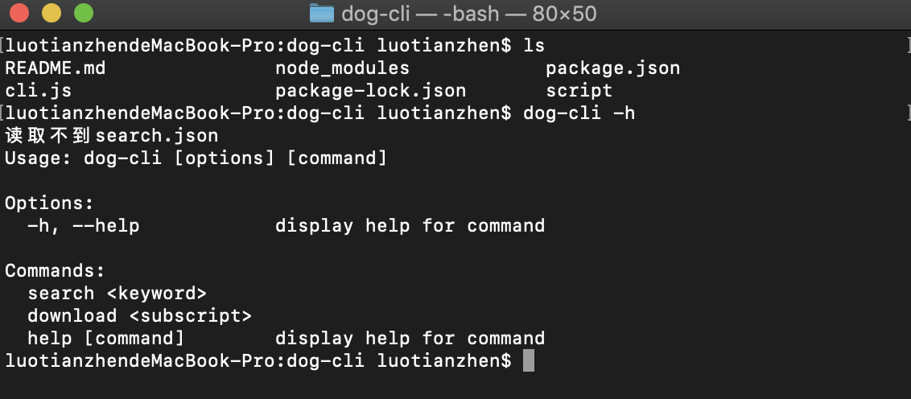
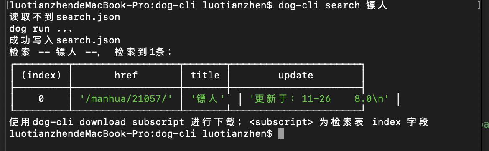
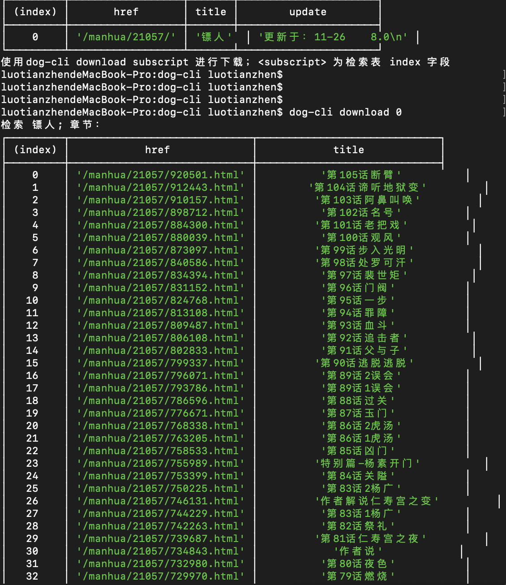

# dog-cli

dog-cli 是笔者七夕一个人吃完烤鱼，回家码出来的。node cli 爬虫小工具。（悲伤的故事讲完）

拉取当前项目，之后：


```cmd
cd dog-cli

/* 这样就可以使用dog-cli 工具了 */
npm link

/* 安装爬虫所需的依赖包 */
npm i
```
## dog-cli 指令

```cmd
dog-cli -h
```

如下图dog-cli只有两个指令 `search` 和 `download`




```cmd
dog-cli search <keyword>

/* 首次使用dog-cli，会在项目目录生成search.json 存放搜索结果。结果表如下：*/
```




```cmd
dog-cli download <subscript>

/* 下载 subscript 参数为搜索结果的下标；每个下标代表一整部漫画
```



注：无法创建XXX目录，先删除之前下载的目录；由于笔者没有在检测到两层文件夹时深度删除文件夹。

数据来源 [漫百分](https://www.manbaifen.com/)